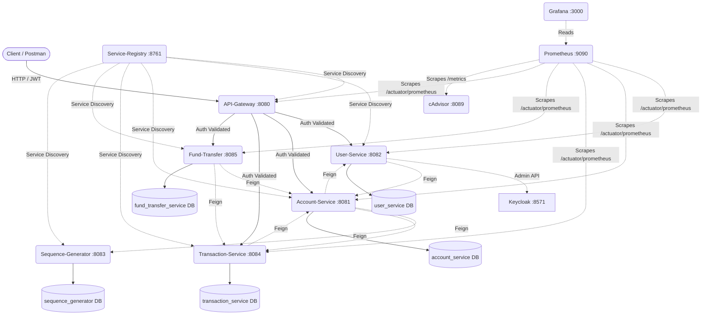
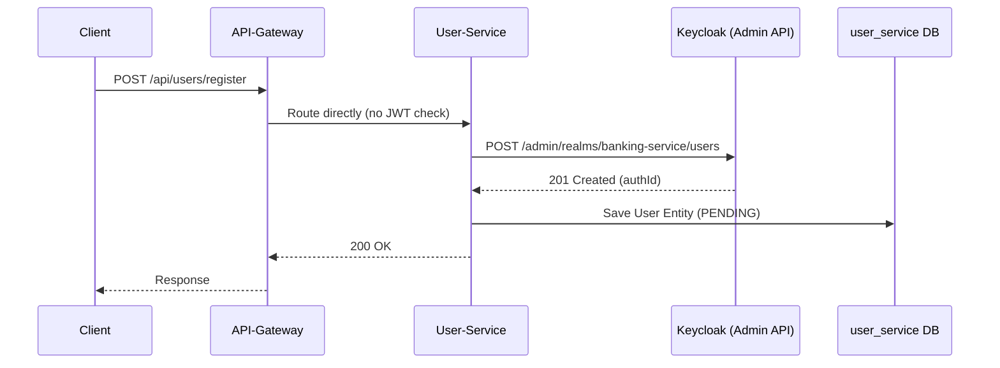
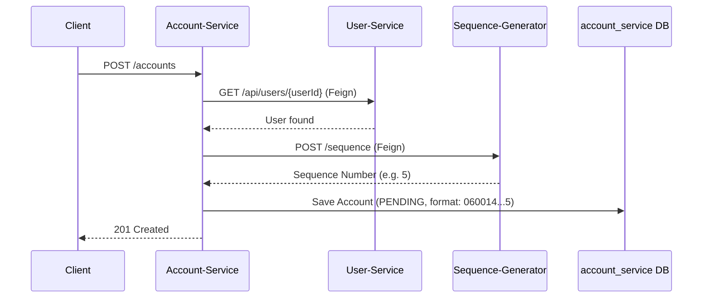
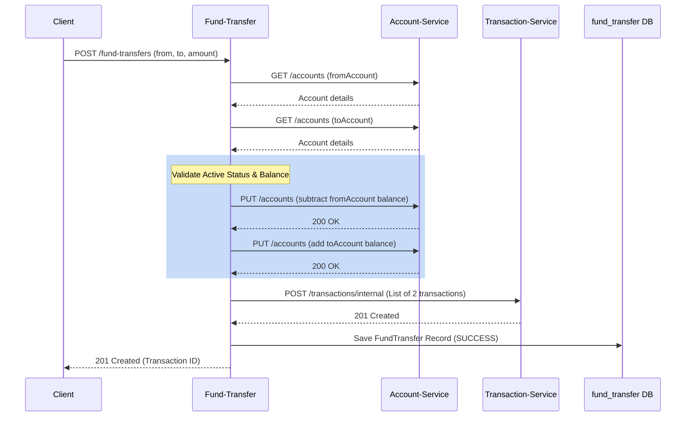
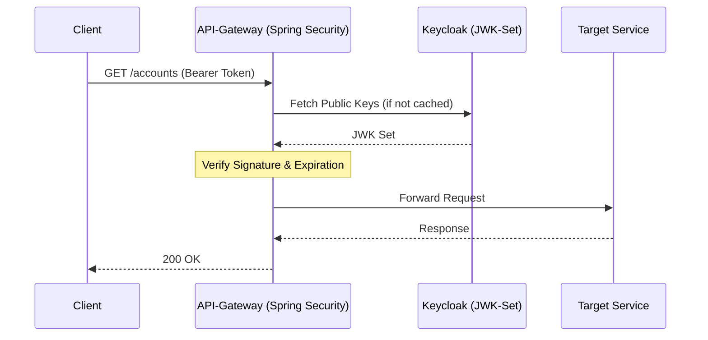

# Project Context: Microservices Banking Application

## 1. What this project is

This project is a Spring Boot-based banking system split into multiple microservices. It provides a core set of retail banking features: users can register an account, open banking accounts, perform deposits and withdrawals, and execute fund transfers between accounts. 

Based on the architecture (e.g., hardcoded passwords, `ddl-auto: update` in JPA settings, and package names like `org.training`), this codebase is intended as a **learning project or portfolio piece** rather than a production-ready application. It demonstrates modern microservice patterns including service discovery, API gateway routing, synchronous inter-service communication, and OAuth2 authentication.

**The single sentence a new engineer should remember first:** 
This is a synchronous Spring Boot microservices ecosystem that uses Netflix Eureka for service discovery, Spring Cloud Gateway for routing and JWT validation, and OpenFeign for direct service-to-service calls.

---

## 2. Tech stack

| Component | Technology | Version | Why it's used here |
| --- | --- | --- | --- |
| **Framework** | Spring Boot | 2.7.14 / 2.7.15 | Provides the core auto-configuration and web server foundation. |
| **API Gateway** | Spring Cloud Gateway | 2021.0.8 | Single entry point that routes traffic and validates OAuth2 JWTs. |
| **Service Discovery** | Netflix Eureka | 2021.0.8 | Allows services to dynamically find and call each other by name (e.g., `lb://user-service`). |
| **Inter-Service Calls** | OpenFeign | 2021.0.8 | Declarative REST client that simplifies HTTP calls between microservices. |
| **Authentication** | Keycloak | 21.0.1 (Admin API) | Acts as the OAuth2 provider for token issuance and user identity management. |
| **Database** | MySQL | mysql-connector-j | Persistent relational storage for each service's entities. |
| **Metrics** | Prometheus / Micrometer | (Via Spring Actuator) | Exposes JVM and HTTP metrics on `/actuator/prometheus`. |
| **Dashboards** | Grafana | 10.1.0 | Visualizes Prometheus metrics for performance engineering. |
| **Container Metrics** | cAdvisor | v0.47.2 | Scrapes raw Docker container resource metrics. |
| **Boilerplate** | Lombok | - | Reduces Java boilerplate (getters, setters, constructors). |

---

## 3. High-level architecture diagram



---

## 4. Service-by-service breakdown

### Service-Registry
- **What it is:** The Eureka server that acts as a phonebook for services to find each other.
- **Port:** 8761
- **REST Endpoints:** None (UI available at root).
- **Feign Clients:** None.
- **Database:** None.
- **Business Logic:** Standard Eureka standalone server (`register-with-eureka: false`).

### API-Gateway
- **What it is:** The public entry point that routes requests to backend services and validates Keycloak JWTs.
- **Port:** 8080
- **REST Endpoints:** Routes everything based on paths (e.g., `/api/users/**` -> `user-service`).
- **Feign Clients:** None.
- **Database:** None.
- **Business Logic:** Contains the `SecurityWebFilterChain` that permits `/api/users/register` publicly but requires authentication for all other exchanges.

### User-Service
- **What it is:** Manages user onboarding, profiles, and syncs user credentials with Keycloak.
- **Port:** 8082
- **REST Endpoints:**
  | Method | Path | What it does | Called by |
  | --- | --- | --- | --- |
  | POST | `/api/users/register` | Creates a new user profile and a Keycloak user. | Public client |
  | GET | `/api/users` | Lists all users. | Client |
  | GET | `/api/users/auth/{authId}` | Gets a user by Keycloak Auth ID. | Client |
  | PATCH | `/api/users/{id}` | Updates user status (enables in Keycloak). | Client |
  | PUT | `/api/users/{id}` | Updates user profile details. | Client |
  | GET | `/api/users/{userId}` | Gets a user by internal ID. | Client, Account-Service |
  | GET | `/api/users/accounts/{accountId}` | Gets user by their account number. | Client |
- **Feign Clients:** `AccountService` -> `GET /accounts` (to find user by account ID).
- **Database:** `user_service` (Table: `user`, `user_profile`). **DDL-Auto is `update`** (this is dangerous for production as Hibernate will automatically alter schemas).
- **Business Logic:** Uses Keycloak Admin API directly to insert users with credentials upon registration. Keycloak assigns an `authId` which is linked locally.

### Account-Service
- **What it is:** Manages banking accounts (creation, status updates, balances).
- **Port:** 8081
- **REST Endpoints:**
  | Method | Path | What it does | Called by |
  | --- | --- | --- | --- |
  | POST | `/accounts` | Opens a new account for a user. | Client |
  | PATCH | `/accounts` | Updates account status (e.g., ACTIVE). | Client |
  | GET | `/accounts` | Gets account by account number. | Client, Fund-Transfer, Transaction, User |
  | PUT | `/accounts` | Updates account details (balance). | Transaction, Fund-Transfer |
  | GET | `/accounts/balance` | Returns available balance. | Client |
  | GET | `/accounts/{accountId}/transactions` | Gets transactions for an account. | Client |
  | PUT | `/accounts/closure` | Closes account (balance must be 0). | Client |
  | GET | `/accounts/{userId}` | Gets account by User ID. | Client |
- **Feign Clients:** 
  - `UserService` -> `GET /api/users/{userId}` (validates user exists).
  - `SequenceService` -> `POST /sequence` (generates the account number).
  - `TransactionService` -> `GET /transactions` (fetches transaction history).
- **Database:** `account_service` (Table: `account`). DDL-Auto is `update`.
- **Business Logic:** Account numbers are generated dynamically by calling the `Sequence-Generator`. Account closures enforce a strict zero-balance check. Minimum balance required is 1000.

### Sequence-Generator
- **What it is:** A dedicated service solely for generating sequential account numbers.
- **Port:** 8083
- **REST Endpoints:**
  | Method | Path | What it does | Called by |
  | --- | --- | --- | --- |
  | POST | `/sequence` | Increments and returns the next account sequence. | Account-Service |
- **Feign Clients:** None.
- **Database:** `sequence_generator` (Table: `sequence`). DDL-Auto is `update`.
- **Business Logic:** Fetches the single row `id=1`, increments it, and returns it.

### Transaction-Service
- **What it is:** Records single-sided transactions (deposits/withdrawals) and internal transfers.
- **Port:** 8084
- **REST Endpoints:**
  | Method | Path | What it does | Called by |
  | --- | --- | --- | --- |
  | POST | `/transactions` | Processes a deposit or withdrawal. | Client |
  | POST | `/transactions/internal` | Saves batched internal transactions. | Fund-Transfer |
  | GET | `/transactions` | Lists transactions for an account. | Client, Account-Service |
  | GET | `/transactions/{referenceId}` | Gets transaction by reference UUID. | Client |
- **Feign Clients:** `AccountService` -> `GET /accounts` & `PUT /accounts` (validates and updates balances).
- **Database:** `transaction_service` (Table: `transaction`). DDL-Auto is `update`.
- **Business Logic:** On withdrawal, verifies account is ACTIVE and checks for sufficient balance before executing the math and calling `Account-Service` to update the balance.

### Fund-Transfer
- **What it is:** Orchestrates transferring funds between two different accounts.
- **Port:** 8085
- **REST Endpoints:**
  | Method | Path | What it does | Called by |
  | --- | --- | --- | --- |
  | POST | `/fund-transfers` | Executes a fund transfer. | Client |
  | GET | `/fund-transfers/{referenceId}` | Looks up a transfer by UUID. | Client |
  | GET | `/fund-transfers` | Looks up all transfers for an account. | Client |
- **Feign Clients:** 
  - `AccountService` -> `GET /accounts` (fetch from/to details) & `PUT /accounts` (update balances).
  - `TransactionService` -> `POST /transactions/internal` (writes the audit trail).
- **Database:** `fund_transfer_service` (Table: `fund_transfer`). DDL-Auto is `update`.
- **Business Logic:** Highly orchestrated: 1. Fetch both accounts. 2. Verify `from` account is ACTIVE. 3. Verify sufficient balance. 4. Subtract/Add balances. 5. Update both accounts via Feign. 6. Tell Transaction-Service to write the debit and credit records. 7. Save local fund transfer record.

---

## 5. Request flow diagrams (sequence diagrams)

### User Registration (Public Route)


### Account Creation


### Fund Transfer Execution


### JWT Validation at Gateway


---

## 6. Authentication & security model

- **Token Issuance:** Keycloak acts as the OAuth2 Authorization Server. Clients must obtain a token from Keycloak directly (on port 8571).
- **Gateway Validation:** The `API-Gateway` is configured as an OAuth2 Resource Server. It intercepts every request (except `/api/users/register`) and validates the JWT signature against Keycloak's `jwk-set-uri`.
- **Public Route Exception:** Registration (`/api/users/register`) is public because a new user does not have a token yet. 
- **Admin API Access:** The `User-Service` uses the Keycloak Admin API Client to programmatically create users in Keycloak when a public registration request arrives.
- **Security Gaps / Known Issues:** 
  - Downstream services (User, Account, Transaction) do not validate the JWT themselves. If an attacker bypasses the Gateway and hits their ports directly, they are entirely unprotected.
  - Hardcoded client secrets exist in configuration files.

---

## 7. Configuration & environment

| Service | Port | Database Name | External Dependencies | Known Issues / Notes |
| --- | --- | --- | --- | --- |
| **Service-Registry** | 8761 | N/A | None | Eureka Server |
| **API-Gateway** | 8080 | N/A | Keycloak (8571), Eureka | **Contains Hardcoded Secret:** `client-secret` for Keycloak. |
| **User-Service** | 8082 | `user_service` | Keycloak (8571), Eureka, MySQL | **Contains Hardcoded Secret:** Admin `client-secret`. |
| **Account-Service** | 8081 | `account_service` | Eureka, MySQL | DB credentials hardcoded (`Netcracker@123`). |
| **Sequence-Generator** | 8083 | `sequence_generator` | Eureka, MySQL | DB credentials hardcoded. |
| **Transaction-Service**| 8084 | `transaction_service` | Eureka, MySQL | DB credentials hardcoded. |
| **Fund-Transfer** | 8085 | `fund_transfer_service`| Eureka, MySQL | DB credentials hardcoded. |

> **IMPORTANT:** Rotate all hardcoded `Netcracker@123` passwords and Keycloak `client-secrets` before any real deployment.

---

## 8. Monitoring & observability

- **Metrics Collection:** Every Spring Boot service includes `spring-boot-starter-actuator` and `micrometer-registry-prometheus`. They expose a `/actuator/prometheus` endpoint.
- **Prometheus:** Runs in Docker (port 9090) and scrapes the `/actuator/prometheus` endpoints of all services (Gateway, User, Account, etc.) as well as cAdvisor.
- **cAdvisor:** Scrapes Docker engine metrics natively to provide container-level CPU/Memory utilization to Prometheus.
- **Grafana:** Runs on port 3000. It reads data from Prometheus. A predefined dashboard (`banking-performance.json`) is provisioned automatically to visualize Latency (p50/p90/p99), RPS, HTTP Status Rates, and System uptime.

---

## 9. How to run this locally

1. Ensure Docker and Docker Compose are installed.
2. Ensure ports `8080-8085`, `8761`, `9090`, `3000`, and `8089` are free.
3. Start the stack from the repository root:
   ```bash
   docker-compose up --build
   ```
4. **Boot Order:** The `docker-compose.yml` specifies `depends_on` rules. `service-registry` (Eureka) starts first. The other services will register with Eureka shortly after booting.
5. **Testing:** Import the Postman collection located in the `postman_collection/` folder (`Banking Core Services.postman_collection.json`) to interact with the API Gateway at `localhost:8080`.

---

## 10. Common failure modes & how to debug them

| Symptom | Likely Cause | How to Debug |
| --- | --- | --- |
| **Feign call fails with 503 / "Service Unavailable"** | Eureka registration timing. The calling service doesn't know where the target is yet. | Wait 30 seconds for Eureka registries to sync. Check `http://localhost:8761`. |
| **JWT 401 Unauthorized at Gateway** | Gateway cannot reach Keycloak, or clock skew on the token. | Verify Keycloak is running at `localhost:8571`. Check Gateway logs for `jwk-set-uri` fetch errors. |
| **Account creation fails silently or throws 500** | The `sequence-generator` service is down. | Check `sequence-generator` container logs. Account creation mandates a synchronous Feign call to get the sequence ID. |
| **Hibernate errors on startup** | Database schemas drifted or `ddl-auto: update` failed. | Drop the MySQL databases manually and let Hibernate recreate them, or fix conflicting column types. |
| **Fund Transfer fails due to balance** | Accounts might be PENDING instead of ACTIVE. | Update account statuses to ACTIVE using the `PATCH /accounts` endpoint. |

---

## 11. Glossary

- **Eureka:** A service registry — think of it as a phonebook services use to find each other dynamically without hardcoded IPs.
- **Feign (OpenFeign):** A library that lets Java code call other REST APIs by just writing interfaces, hiding the HTTP client boilerplate.
- **JWT (JSON Web Token):** A secure, signed string representing the user's identity and permissions, issued by Keycloak.
- **lb:// (Load Balancer URI):** A routing syntax used by the Gateway to tell it "Look up this service name in Eureka and route to it."
- **Actuator:** A Spring Boot module that automatically creates endpoints (`/health`, `/metrics`) to check the application's status.
- **DDL Auto (ddl-auto: update):** A Hibernate setting that automatically creates or alters database tables based on Java code. (Convenient for dev, dangerous for prod).

---

## 12. Quick reference card

| Service | Port | Gateway Base Path | Database Name |
| --- | --- | --- | --- |
| **Service-Registry** | 8761 | N/A | N/A |
| **API-Gateway** | 8080 | `/` | N/A |
| **User-Service** | 8082 | `/api/users/**` | `user_service` |
| **Account-Service** | 8081 | `/accounts/**` | `account_service` |
| **Sequence-Generator** | 8083 | `/sequence/**` | `sequence_generator` |
| **Transaction-Service**| 8084 | `/transactions/**` | `transaction_service` |
| **Fund-Transfer** | 8085 | `/api/fund-transfers/**` and `/fund-transfers/**` | `fund_transfer_service` |

*Last verified against codebase state on 2026-08-23*
