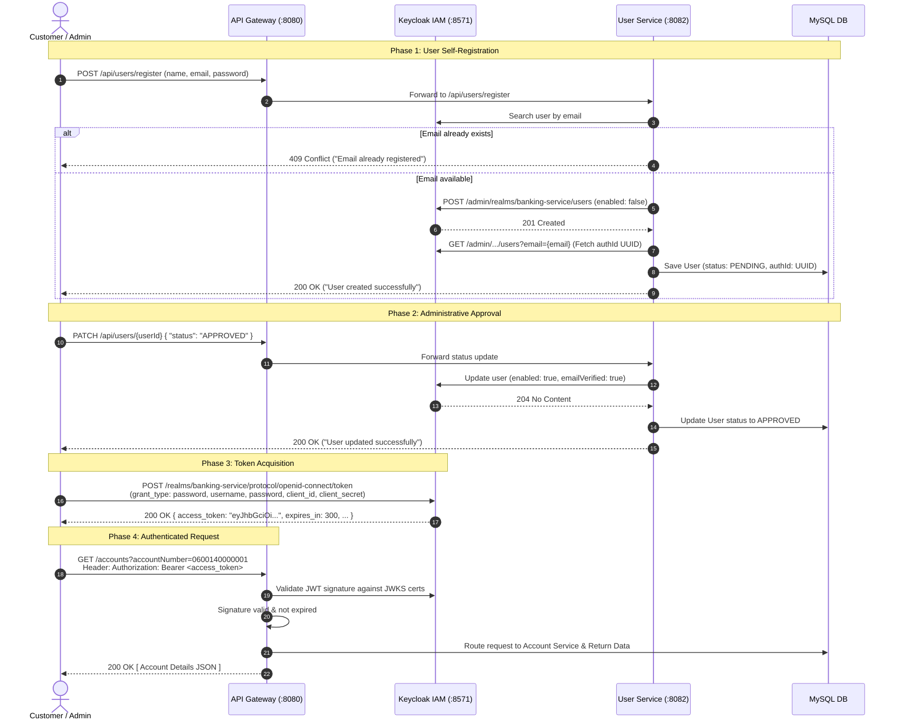

# 🛡️ Security & Authentication Architecture Guide

This document provides an exhaustive, senior-engineer-level breakdown of the **Security, Authentication, and Authorization Architecture** implemented across the Spring Boot Microservices Banking Application. It includes internal system mechanics, JWT token lifecycles, configuration specifications, end-to-end sequences, Postman/cURL test flows, and production-hardening guidelines.

---

## 📋 Table of Contents

1. [Executive Summary & High-Level Architecture](#1-executive-summary--high-level-architecture)
2. [Identity & Access Management (IAM) — Keycloak Configuration](#2-identity--access-management-iam--keycloak-configuration)
3. [Component Security Mechanics](#3-component-security-mechanics)
   - [3.1 User Service & Keycloak Admin Client Integration](#31-user-service--keycloak-admin-client-integration)
   - [3.2 API Gateway as an OAuth2 / JWT Resource Server](#32-api-gateway-as-an-oauth2--jwt-resource-server)
   - [3.3 Downstream Microservice Isolation & Trust Model](#33-downstream-microservice-isolation--trust-model)
4. [User Lifecycle & Authentication State Machine](#4-user-lifecycle--authentication-state-machine)
5. [End-to-End Workflow & Sequence Diagrams](#5-end-to-end-workflow--sequence-diagrams)
6. [Complete Postman & cURL API Reference](#6-complete-postman--curl-api-reference)
   - [6.1 Token Generation (Keycloak Direct Grant)](#61-token-generation-keycloak-direct-grant)
   - [6.2 User Service Endpoints](#62-user-service-endpoints)
   - [6.3 Account Service Endpoints](#63-account-service-endpoints)
   - [6.4 Transaction Service Endpoints](#64-transaction-service-endpoints)
   - [6.5 Fund Transfer Service Endpoints](#65-fund-transfer-service-endpoints)
   - [6.6 Sequence Generator Endpoints](#66-sequence-generator-endpoints)
7. [Security Assessment, Audit Findings & Hardening Recommendations](#7-security-assessment-audit-findings--hardening-recommendations)

---

## 1. Executive Summary & High-Level Architecture

The banking platform implements a **Centralized Identity & Perimeter-Secured Microservices Pattern**:

* **Identity Provider (IdP)**: [Keycloak](https://www.keycloak.org/) is the single source of truth for user identities, password hashing (PBKDF2/Argon2), credential storage, and JWT token issuance.
* **Perimeter Security**: [API-Gateway](file:///API-Gateway) (built on Spring Cloud Gateway & Spring WebFlux) acts as the entry point and OAuth2 Resource Server. It validates asymmetric cryptographic signatures on JSON Web Tokens (JWT) using Keycloak's JSON Web Key Set (JWKS).
* **Decoupled User Profiles**: [User-Service](file:///User-Service) synchronizes user identities between Keycloak and a local relational database (`user_service` MySQL schema), linking banking domain profile data to Keycloak's unique `authId` (UUID).
* **Internal Network Trust**: Downstream microservices (`Account-Service`, `Transaction-Service`, `Fund-Transfer`, `Sequence-Generator`) operate inside a secure internal network behind the API Gateway and Eureka Service Registry.

```
                                      ┌────────────────────────────────────────┐
                                      │           KEYCLOAK (IAM) :8571         │
                                      │  Realm: banking-service                │
                                      │  - Credential verification             │
                                      │  - Issues signed JWT Access Tokens     │
                                      │  - Exposes JWKS Public Keys (/certs)   │
                                      └───────────────────▲────────────────────┘
                                                          │
                    1. POST /protocol/openid-connect/token│ (Direct Access Grant)
                    2. Returns Signed Bearer JWT Token    │
                                                          │
┌─────────────────────────┐                               │
│       HTTP Client       ├───────────────────────────────┘
│  (Postman / Web / App)  │
└───────────┬─────────────┘
            │
            │ 3. API Request with Header: "Authorization: Bearer <JWT>"
            ▼
┌──────────────────────────────────────────────────────────────────────────────┐
│                            API GATEWAY :8080                                 │
│  Spring Cloud Gateway (Reactive WebFlux + OAuth2 Resource Server)            │
│  - Fetches and caches Keycloak JWKS public certs                             │
│  - Validates JWT signature, expiration (exp), issuer (iss)                   │
│  - Routes authorized traffic via Eureka service discovery                    │
└───────┬───────────────────────┬──────────────────────┬───────────────────────┘
        │ lb://user-service     │ lb://account-service │ lb://transaction-service
        ▼                       ▼                      ▼
┌──────────────────┐   ┌──────────────────┐   ┌────────────────────────┐
│   USER SERVICE   │   │ ACCOUNT SERVICE  │   │  TRANSACTION SERVICE   │
│      :8082       │   │      :8081       │   │         :8084          │
└────────┬─────────┘   └──────────────────┘   └────────────────────────┘
         │
         │ Keycloak Admin Client (client_credentials)
         ▼
┌──────────────────┐
│ KEYCLOAK REALM   │
│ User Management  │
└──────────────────┘
```

---

## 2. Identity & Access Management (IAM) — Keycloak Configuration

The system is configured around Keycloak running standalone or containerized on port `8571`.

### 2.1 Realm & Client Topology

| Entity | Value | Description |
| :--- | :--- | :--- |
| **Server URL** | `http://localhost:8571` | Keycloak server base URL |
| **Realm Name** | `banking-service` | Isolated tenant realm containing all banking domain identities and keys |
| **API Client** | `banking-service-client` | Client ID configured with **Direct Access Grants Enabled** for token requests via Postman and gateway authentication |
| **Client Secret** | `7ZXjz5ZBz9EzoBBr1reNOVfmd2XqQSwJ` | Client secret for `banking-service-client` |
| **Service Admin Client** | `banking-service-api-client` | Client ID used by `User-Service` with `client_credentials` grant type and service account roles to manage users |
| **Admin Secret** | `ooZV25AjCo15w8A7Qum50VjrTbkie0EE` | Client secret used by `User-Service` Keycloak Admin SDK |

### 2.2 Keycloak OpenID Connect Endpoints

All OAuth2 / OIDC discovery endpoints are derived from the realm base URL:

* **Authorization Endpoint**:
  `http://localhost:8571/realms/banking-service/protocol/openid-connect/auth`
* **Token Endpoint**:
  `http://localhost:8571/realms/banking-service/protocol/openid-connect/token`
* **JWKS Certificates Endpoint (Public Keys)**:
  `http://localhost:8571/realms/banking-service/protocol/openid-connect/certs`
* **UserInfo Endpoint**:
  `http://localhost:8571/realms/banking-service/protocol/openid-connect/userinfo`

---

## 3. Component Security Mechanics

### 3.1 User Service & Keycloak Admin Client Integration

The `User-Service` acts as an administrative bridge between the banking application and Keycloak using the `org.keycloak:keycloak-admin-client` SDK.

#### 1. Configuration & Connection (`KeyCloakProperties.java` & `KeyCloakManager.java`)
`User-Service` initializes a singleton instance of the Keycloak client using the `client_credentials` grant flow:

```java
public Keycloak getKeycloakInstance() {
    if (keycloakInstance == null) {
        keycloakInstance = KeycloakBuilder.builder()
                .serverUrl(serverUrl)
                .realm(realm)
                .clientId(clientId)
                .clientSecret(clientSecret)
                .grantType("client_credentials")
                .build();
    }
    return keycloakInstance;
}
```

#### 2. Registration Flow (`UserServiceImpl.createUser`)
When a new customer registers:
1. `User-Service` queries Keycloak to verify if the email is already in use (`keycloakService.readUserByEmail`).
2. If available, a `UserRepresentation` is constructed with:
   - `username`: Email address
   - `email`: Email address
   - `enabled`: `false` *(Account cannot log in or generate tokens until approved)*
   - `emailVerified`: `false`
   - `credentials`: Non-temporary password string
3. `KeycloakService.createUser()` sends a REST request to Keycloak's Admin API (`POST /admin/realms/banking-service/users`).
4. Keycloak persists the user and returns HTTP `201 Created`.
5. `User-Service` queries Keycloak for the generated user ID (`authId` UUID) and saves the local entity in MySQL with status `PENDING`.

#### 3. Approval Flow (`UserServiceImpl.updateUserStatus`)
Banking compliance requires administrative verification before activating accounts:
1. An admin updates the user status to `APPROVED` (`PATCH /api/users/{id}`).
2. `User-Service` fetches the Keycloak user representation using `authId`.
3. Sets `enabled = true` and `emailVerified = true`.
4. Executes `keycloakService.updateUser(userRepresentation)`.
5. The customer is now activated in Keycloak and capable of acquiring OAuth2 tokens.

---

### 3.2 API Gateway as an OAuth2 / JWT Resource Server

The `API-Gateway` enforces token validation without maintaining session state.

#### 1. Dependencies (`API-Gateway/pom.xml`)
* `spring-boot-starter-oauth2-client`
* `spring-boot-starter-oauth2-resource-server`
* `spring-cloud-starter-gateway`

#### 2. Resource Server Configuration (`application.yml`)
```yaml
spring:
  security:
    oauth2:
      resourceserver:
        jwt:
          jwk-set-uri: http://localhost:8571/realms/banking-service/protocol/openid-connect/certs
```

#### 3. Reactive Security Filter Chain (`SecurityConfig.java`)
```java
@Configuration
@EnableWebFluxSecurity
public class SecurityConfig {

    @Bean
    public SecurityWebFilterChain securityWebFilterChain(ServerHttpSecurity http) {
        http
            .authorizeExchange()
                // Public endpoint: Allow customer self-registration
                .pathMatchers("/api/users/register").permitAll()
                // All other endpoints
                .anyExchange().permitAll() // Note: In production, switch to .authenticated()
            .and()
                .csrf().disable()
                .oauth2Login()
            .and()
                .oauth2ResourceServer()
                .jwt(); // Validates cryptographic signatures against JWKS certs
        return http.build();
    }
}
```

#### How Token Verification Works at the Gateway:
1. The client supplies the header `Authorization: Bearer <JWT>`.
2. The Gateway extracts the JWT and inspects the `kid` (Key ID) header parameter.
3. The Gateway matches `kid` against the public keys cached from Keycloak's `jwk-set-uri`.
4. It cryptographically verifies the RSA-256 signature using Keycloak's public key.
5. It checks standard claims:
   - `exp`: Expiration timestamp (rejects expired tokens).
   - `nbf`: Not before timestamp.
   - `iss`: Issuer URI (must match the Keycloak realm).
6. If valid, the request is passed downstream to the appropriate microservice.

---

### 3.3 Downstream Microservice Isolation & Trust Model

In this architecture:
* Downstream services (`Account-Service`, `Transaction-Service`, `Fund-Transfer`, `Sequence-Generator`) sit behind the API Gateway on an internal network.
* Inter-service communication takes place over REST via **OpenFeign** clients registered with **Eureka Service Registry** (e.g., `Fund-Transfer` calling `Account-Service` and `Transaction-Service`).
* The Gateway acts as the security boundary, ensuring unauthenticated or invalid requests never penetrate into the microservice network.

---

## 4. User Lifecycle & Authentication State Machine

```
   [ Customer Registration ]
               │
               ▼
   Keycloak User Created (enabled: false)
   MySQL DB: Status = PENDING
               │
               ├──────────────────────────────────────────┐
               │                                          │
    Attempts Login prematurely                 Admin Approves User
               │                                          │
               ▼                                          ▼
   Keycloak Rejects Request                   Keycloak: enabled = true, emailVerified = true
   (400 Bad Request: "Account is disabled")   MySQL DB: Status = APPROVED
                                                          │
                                                          ▼
                                              Customer Logs in via Keycloak
                                                          │
                                                          ▼
                                              JWT Access Token Issued
                                                          │
                                                          ▼
                                              Authorized Banking Operations
```

---

## 5. End-to-End Workflow & Sequence Diagrams

### 5.1 Registration, Approval, and Login Sequence



---

## 6. Complete Postman & cURL API Reference

All requests can be sent through the **API Gateway** (`http://localhost:8080`) or directly to **Keycloak** (`http://localhost:8571`).

---

### 6.1 Token Generation (Keycloak Direct Grant)

Used to authenticate a user and retrieve a JWT Access Token.

* **Method**: `POST`
* **URL**: `http://localhost:8571/realms/banking-service/protocol/openid-connect/token`
* **Content-Type**: `application/x-www-form-urlencoded`

#### Request Parameters (Body):
| Parameter | Value | Type | Description |
| :--- | :--- | :--- | :--- |
| `grant_type` | `password` | String | Direct Access Grant |
| `client_id` | `banking-service-client` | String | Configured OAuth2 client |
| `client_secret` | `7ZXjz5ZBz9EzoBBr1reNOVfmd2XqQSwJ` | String | Client secret key |
| `username` | `super-user` *(or registered email)* | String | User's login username or email |
| `password` | `atharva61` *(or user password)* | String | User's password |
| `scope` | `openid offline_access` | String | Requested OAuth2 scopes |

#### cURL Command:
```bash
curl -X POST http://localhost:8571/realms/banking-service/protocol/openid-connect/token \
  -H "Content-Type: application/x-www-form-urlencoded" \
  -d "grant_type=password" \
  -d "client_id=banking-service-client" \
  -d "client_secret=7ZXjz5ZBz9EzoBBr1reNOVfmd2XqQSwJ" \
  -d "username=super-user" \
  -d "password=atharva61" \
  -d "scope=openid offline_access"
```

#### Sample Response:
```json
{
  "access_token": "eyJhbGciOiJSUzI1NiIsInR5cCIgOiAiSldUIiwia2lkIiA6ICI...",
  "expires_in": 300,
  "refresh_expires_in": 1800,
  "refresh_token": "eyJhbGciOiJIUzI1NiIsInR5cCIgOiAiSldUIiwia2lkIiA6ICI...",
  "token_type": "Bearer",
  "not-before-policy": 0,
  "session_state": "4020c029-...",
  "scope": "openid profile email offline_access"
}
```

---

### 6.2 User Service Endpoints

#### 1. Register User (Public)
* **Method**: `POST`
* **URL**: `http://localhost:8080/api/users/register`
* **Headers**: `Content-Type: application/json`

```bash
curl -X POST http://localhost:8080/api/users/register \
  -H "Content-Type: application/json" \
  -d '{
    "firstName": "Adam",
    "lastName": "Sanadi",
    "emailId": "adamsanadi1234@gmail.com",
    "contactNumber": "8547159267",
    "password": "Adam@1234"
  }'
```
**Sample Response (`200 OK`):**
```json
{
  "responseCode": "200",
  "responseMessage": "User created successfully"
}
```

#### 2. Update User Status (Admin Approval)
* **Method**: `PATCH`
* **URL**: `http://localhost:8080/api/users/1`
* **Headers**: `Content-Type: application/json`, `Authorization: Bearer <JWT>`

```bash
curl -X PATCH http://localhost:8080/api/users/1 \
  -H "Content-Type: application/json" \
  -H "Authorization: Bearer <ACCESS_TOKEN>" \
  -d '{
    "status": "APPROVED"
  }'
```
**Sample Response (`200 OK`):**
```json
{
  "responseCode": "200",
  "responseMessage": "User updated successfully"
}
```

#### 3. Update User Profile Details
* **Method**: `PUT`
* **URL**: `http://localhost:8080/api/users/1`
* **Headers**: `Content-Type: application/json`, `Authorization: Bearer <JWT>`

```bash
curl -X PUT http://localhost:8080/api/users/1 \
  -H "Content-Type: application/json" \
  -H "Authorization: Bearer <ACCESS_TOKEN>" \
  -d '{
    "firstName": "Kishan",
    "lastName": "Kulkarni",
    "contactNo": "9562148579",
    "address": "Behind Prasad Lodge, Extension Masari",
    "gender": "Male",
    "occupation": "Student",
    "martialStatus": "Single",
    "nationality": "Indian"
  }'
```

#### 4. Read User by ID
* **Method**: `GET`
* **URL**: `http://localhost:8080/api/users/1`
* **Headers**: `Authorization: Bearer <JWT>`

```bash
curl -X GET http://localhost:8080/api/users/1 \
  -H "Authorization: Bearer <ACCESS_TOKEN>"
```

#### 5. Read All Users
* **Method**: `GET`
* **URL**: `http://localhost:8080/api/users`
* **Headers**: `Authorization: Bearer <JWT>`

```bash
curl -X GET http://localhost:8080/api/users \
  -H "Authorization: Bearer <ACCESS_TOKEN>"
```

#### 6. Read User by Keycloak Auth ID
* **Method**: `GET`
* **URL**: `http://localhost:8080/api/users/auth/3f83737b-ec86-4f47-a8fe-3bcbe998797f`
* **Headers**: `Authorization: Bearer <JWT>`

```bash
curl -X GET http://localhost:8080/api/users/auth/3f83737b-ec86-4f47-a8fe-3bcbe998797f \
  -H "Authorization: Bearer <ACCESS_TOKEN>"
```

#### 7. Read User by Account ID
* **Method**: `GET`
* **URL**: `http://localhost:8080/api/users/accounts/0600140000001`
* **Headers**: `Authorization: Bearer <JWT>`

```bash
curl -X GET http://localhost:8080/api/users/accounts/0600140000001 \
  -H "Authorization: Bearer <ACCESS_TOKEN>"
```

---

### 6.3 Account Service Endpoints

#### 1. Create Bank Account
* **Method**: `POST`
* **URL**: `http://localhost:8080/accounts`
* **Headers**: `Content-Type: application/json`, `Authorization: Bearer <JWT>`

```bash
curl -X POST http://localhost:8080/accounts \
  -H "Content-Type: application/json" \
  -H "Authorization: Bearer <ACCESS_TOKEN>" \
  -d '{
    "accountType": "SAVINGS_ACCOUNT",
    "userId": "1"
  }'
```
**Sample Response (`201 Created`):**
```json
{
  "responseCode": "201",
  "responseMessage": "Account created successfully with Account Number 0600140000001"
}
```

#### 2. Read Account by Account Number
* **Method**: `GET`
* **URL**: `http://localhost:8080/accounts?accountNumber=0600140000001`
* **Headers**: `Authorization: Bearer <JWT>`

```bash
curl -X GET "http://localhost:8080/accounts?accountNumber=0600140000001" \
  -H "Authorization: Bearer <ACCESS_TOKEN>"
```

#### 3. Update Account Status
* **Method**: `PATCH`
* **URL**: `http://localhost:8080/accounts?accountNumber=0600140000001`
* **Headers**: `Content-Type: application/json`, `Authorization: Bearer <JWT>`

```bash
curl -X PATCH "http://localhost:8080/accounts?accountNumber=0600140000001" \
  -H "Content-Type: application/json" \
  -H "Authorization: Bearer <ACCESS_TOKEN>" \
  -d '{
    "accountStatus": "ACTIVE"
  }'
```

#### 4. Read Account by User ID
* **Method**: `GET`
* **URL**: `http://localhost:8080/accounts/1`
* **Headers**: `Authorization: Bearer <JWT>`

```bash
curl -X GET http://localhost:8080/accounts/1 \
  -H "Authorization: Bearer <ACCESS_TOKEN>"
```

#### 5. Close Account
* **Method**: `PUT`
* **URL**: `http://localhost:8080/accounts/closure?accountNumber=0600140000001`
* **Headers**: `Authorization: Bearer <JWT>`

```bash
curl -X PUT "http://localhost:8080/accounts/closure?accountNumber=0600140000001" \
  -H "Authorization: Bearer <ACCESS_TOKEN>"
```

---

### 6.4 Transaction Service Endpoints

#### 1. Make a Transaction (Deposit / Withdrawal)
* **Method**: `POST`
* **URL**: `http://localhost:8080/transactions`
* **Headers**: `Content-Type: application/json`, `Authorization: Bearer <JWT>`

```bash
curl -X POST http://localhost:8080/transactions \
  -H "Content-Type: application/json" \
  -H "Authorization: Bearer <ACCESS_TOKEN>" \
  -d '{
    "accountId": "0600140000001",
    "transactionType": "DEPOSIT",
    "amount": "1000",
    "description": "Initial account deposit"
  }'
```
**Sample Response (`200 OK`):**
```json
{
  "responseCode": "200",
  "responseMessage": "Transaction executed successfully with Reference 0671cbe4-fefb-4a60-9e55-93bfb1d5895c"
}
```

#### 2. Get Transactions for an Account
* **Method**: `GET`
* **URL**: `http://localhost:8080/transactions?accountId=0600140000001`
* **Headers**: `Authorization: Bearer <JWT>`

```bash
curl -X GET "http://localhost:8080/transactions?accountId=0600140000001" \
  -H "Authorization: Bearer <ACCESS_TOKEN>"
```

#### 3. Get Transaction by Reference Number
* **Method**: `GET`
* **URL**: `http://localhost:8080/transactions/0671cbe4-fefb-4a60-9e55-93bfb1d5895c`
* **Headers**: `Authorization: Bearer <JWT>`

```bash
curl -X GET http://localhost:8080/transactions/0671cbe4-fefb-4a60-9e55-93bfb1d5895c \
  -H "Authorization: Bearer <ACCESS_TOKEN>"
```

---

### 6.5 Fund Transfer Service Endpoints

#### 1. Transfer Funds Between Accounts
* **Method**: `POST`
* **URL**: `http://localhost:8080/fund-transfers`
* **Headers**: `Content-Type: application/json`, `Authorization: Bearer <JWT>`

```bash
curl -X POST http://localhost:8080/fund-transfers \
  -H "Content-Type: application/json" \
  -H "Authorization: Bearer <ACCESS_TOKEN>" \
  -d '{
    "fromAccount": "0600140000001",
    "toAccount": "0600140000002",
    "amount": "500"
  }'
```

#### 2. Get Transfer Details by Reference ID
* **Method**: `GET`
* **URL**: `http://localhost:8080/fund-transfers/950e07f5-09ce-4fee-be66-3377233458ad`
* **Headers**: `Authorization: Bearer <JWT>`

```bash
curl -X GET http://localhost:8080/fund-transfers/950e07f5-09ce-4fee-be66-3377233458ad \
  -H "Authorization: Bearer <ACCESS_TOKEN>"
```

#### 3. Get All Fund Transfers from an Account
* **Method**: `GET`
* **URL**: `http://localhost:8080/fund-transfers?accountId=0600140000001`
* **Headers**: `Authorization: Bearer <JWT>`

```bash
curl -X GET "http://localhost:8080/fund-transfers?accountId=0600140000001" \
  -H "Authorization: Bearer <ACCESS_TOKEN>"
```

---

### 6.6 Sequence Generator Endpoints

#### Generate Account Number Sequence (Internal Service)
* **Method**: `POST`
* **URL**: `http://localhost:8080/sequence`
* **Headers**: `Authorization: Bearer <JWT>`

```bash
curl -X POST http://localhost:8080/sequence \
  -H "Authorization: Bearer <ACCESS_TOKEN>"
```

---

## 7. Security Assessment, Audit Findings & Hardening Recommendations

As a Senior Backend Engineer reviewing this system, the following audit items and architectural hardening recommendations must be noted for enterprise production deployments:

### 7.1 Immediate Code Hardening: Gateway Authorization Enforcement

> [!WARNING]
> In [`API-Gateway/src/main/java/org/training/api/gateway/config/SecurityConfig.java`](file:///API-Gateway/src/main/java/org/training/api/gateway/config/SecurityConfig.java#L20-L28), the configuration currently contains `.anyExchange().permitAll()`. While the OAuth2 Resource Server and JWT decoder are fully active, all requests are permitted through for local development convenience.

#### Production Remediation:
Update `SecurityConfig.java` to enforce authentication across all routes while whitelisting only public endpoints:

```java
@Bean
public SecurityWebFilterChain securityWebFilterChain(ServerHttpSecurity http) {
    http
        .csrf().disable()
        .authorizeExchange()
            // Public endpoints (Registration & Actuator Health)
            .pathMatchers("/api/users/register").permitAll()
            .pathMatchers("/actuator/health", "/actuator/info", "/actuator/prometheus").permitAll()
            
            // Role-based restrictions (Example)
            .pathMatchers(HttpMethod.PATCH, "/api/users/**").hasAuthority("SCOPE_admin")
            
            // Enforce JWT authentication on every other endpoint
            .anyExchange().authenticated()
        .and()
        .oauth2ResourceServer()
            .jwt();

    return http.build();
}
```

---

### 7.2 Secrets & Credentials Management

* **Current State**: Hardcoded client secrets (e.g., `7ZXjz5ZBz9EzoBBr1reNOVfmd2XqQSwJ`, `ooZV25AjCo15w8A7Qum50VjrTbkie0EE`) and database credentials exist in `application.yml` and Postman collections.
* **Production Recommendation**:
  1. Externalize all secrets using environment variables or a secret store like **HashiCorp Vault** or **AWS Secrets Manager**.
  2. Use Spring Cloud Vault or Kubernetes Secrets injection (`${KEYCLOAK_CLIENT_SECRET}`).

---

### 7.3 Inter-Service Token Propagation (Zero-Trust Model)

* **Current State**: Once past the API Gateway, inter-service Feign calls do not carry the original caller's JWT token.
* **Production Recommendation**:
  Implement a Feign `RequestInterceptor` in downstream services to forward the `Authorization` header:

```java
@Configuration
public class FeignClientSecurityConfig {

    @Bean
    public RequestInterceptor requestInterceptor() {
        return requestTemplate -> {
            ServletRequestAttributes attributes = (ServletRequestAttributes) RequestContextHolder.getRequestAttributes();
            if (attributes != null) {
                String authorization = attributes.getRequest().getHeader(HttpHeaders.AUTHORIZATION);
                if (authorization != null) {
                    requestTemplate.header(HttpHeaders.AUTHORIZATION, authorization);
                }
            }
        };
    }
}
```

---

### 7.4 Fine-Grained Role-Based Access Control (RBAC)

* **Recommendation**: Map Keycloak Realm Roles (`ROLE_CUSTOMER`, `ROLE_TELLER`, `ROLE_ADMIN`) into Spring Security authorities.
* Extract realm roles from JWT claims (`realm_access.roles`) using a custom `ReactiveJwtAuthenticationConverter` in the API Gateway or individual services to restrict endpoints such as Account Closure or User Approvals strictly to administrative users.

---

### 7.5 Defense in Depth & Network Security

1. **TLS / HTTPS Everywhere**: Terminate TLS at the reverse proxy / ingress controller, and enforce mTLS (mutual TLS) between microservices.
2. **Rate Limiting**: Enable Spring Cloud Gateway's `RequestRateLimiter` filter using Redis (`RedisRateLimiter`) on login and transfer endpoints to protect against brute-force and DDoS attacks.
3. **CORS Configuration**: Restrict allowed origins in the Gateway to trusted front-end domains instead of open wildcard origins.
